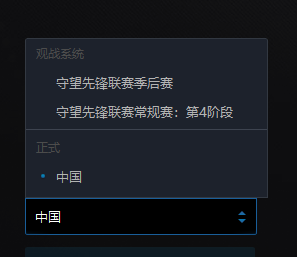
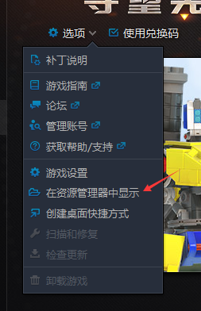
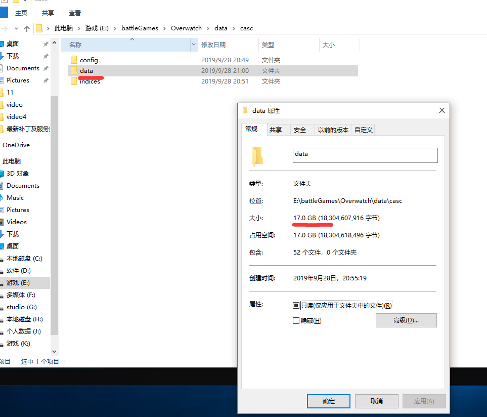
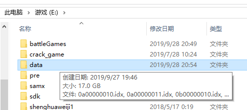
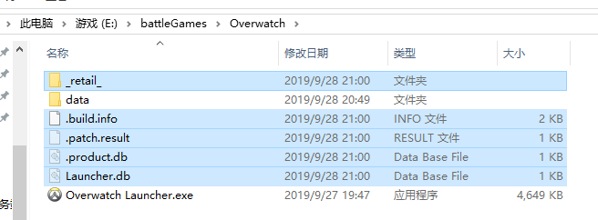
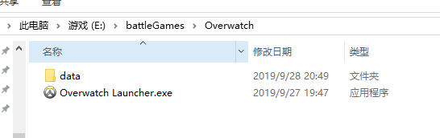
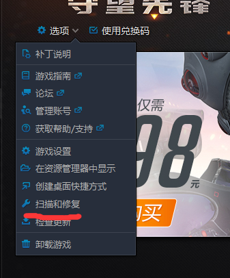
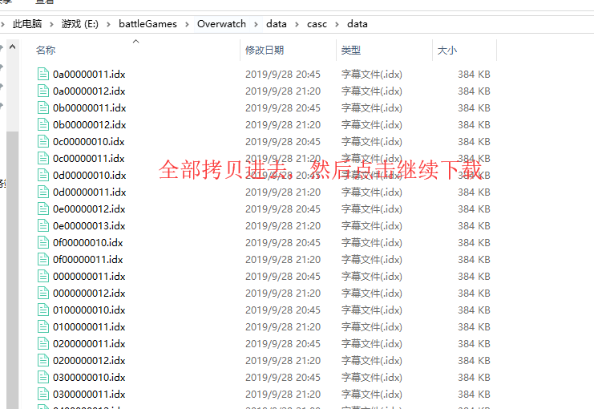

# 一.起因
emmm 身为一个守望先锋的业余玩家, 周末心血来潮打了两把, 然后发现多了个观战系统...


这个组件默认安装在了守望先锋的根目录与原游戏文件集成在一起
安装后当启动原来游戏的时候, 就会出现这个bug `@暴雪官方`

> 无法找到资源0xe00300d0

所以心急如焚去暴雪论坛寻求帮助, 但是官方也解决不了这个问题, 只有重新下载客户端, 守望先锋客户端非常的大, 重新下载很难受的, 经过了一番研究, 这里给大家提供一个解决方法.

# 二.解决方案

首先到游戏根目录去



然后进入目录
```
data/casc
```

我们会看到一个一模一样的data, 查看属性有17个G, 这个就是我们的游戏资源文件了



### 1.首先备份这个data, 拷贝到任何地方, 我就拷贝到了e盘根目录了



### 2.删除游戏文件

选中的一并删除




### 3.选择修复



点击后可能出现两个结果

>1.自动修复了删除的文件, 可以正常进入游戏了, 下面的就不用看了.
2.不能自动修复, 系统会帮你重新下载游戏, 但是重新下载太大了, 这时备份的data就派上用场了, 请继续往下看.


### 4.手动安装

点击暂停, 先把客户端下载的data目录里面的文件删除, 然后把备份data里面的所有文件拷贝到里面去, 然后点击继续下载, 系统就会检测到已经有游戏文件了, 会瞬间安装完成.




# finally enjoy it.
# by objcat #5305
# 2019.09.28


